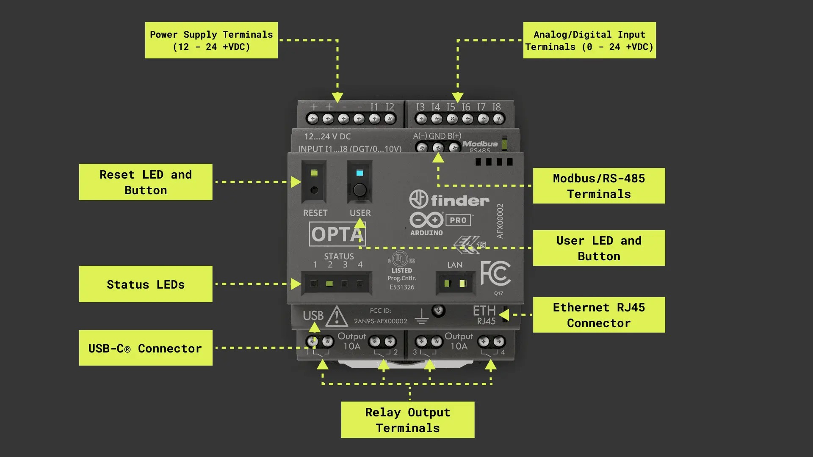

# Instructor Notes: Module 00 – What is a PLC?

---

## Module Purpose
This module introduces students to the foundational concept of a Programmable Logic Controller (PLC) as a reliable, deterministic computing system used in industrial environments to automate and control physical processes.

The purpose of this module is to:

- Define what a PLC is and what it is not (compared to microcontrollers, desktop computers, etc.)

- Explain the core components of a PLC system, including the processor, I/O modules, power supply, and communication interfaces

- Ground students in the real-world relevance of PLCs by exploring where they are used (factories, elevators, HVAC, irrigation, etc.)

- Clarify the role of deterministic control and fail-safe logic in industrial systems

- Introduce IEC 61131-3 and the concept of standardized programming languages (Ladder Logic, ST, FBD, etc.)

This is a non-coding module focused on establishing conceptual clarity, preparing students to approach hands-on labs with context and purpose.

Where this is taught:

- Definitions and examples are covered in the Student Guide

- Instructor may present visuals or diagrams from the GitHub 03_assets/00_intro_plc folder

- Reference: Arduino Explore PLC course - [Arduino PLC Course – “What is a PLC?”](https://courses.arduino.cc/explore-plc/lessons/history-present-plc/)

---

## Objective

Introduce students to the purpose and importance of PLCs using relatable examples and light interaction. This sets the tone for the course and builds relevance before hands-on labs begin.

---

## Linked Resources

- [Student Guide: What is a PLC?](../00_What_is_a_PLC/00_SG_What_is_a_PLC.md)
- [Arduino PLC Course – “What is a PLC?”](https://courses.arduino.cc/explore-plc/lessons/history-present-plc/)

**Opta Hardware Overview**

Make sure students have access to these materials during the lesson. The Arduino image can be displayed during the warm-up or demo.

---

## Materials Required

- Slides or handout of the article
- Whiteboard or projector
- Arduino Opta demo unit (optional but helpful)

---

## Pre-Class Setup

- Print or distribute digital copy of the “What is a PLC?” document
- Set up projector or display to show key diagrams (e.g., Opta photo, sensor examples)

---

## Suggested Flow

1. **Warm-Up Discussion** (5 min)
   - “What runs traffic lights? Elevators? Amusement rides?”
   - Students brainstorm what might control those systems

2. **Read-Aloud or Silent Reading** (10 min)
   - Article walkthrough
   - Highlight bolded terms and answer quick Qs as needed

3. **Group Challenge** (10 min)
   - Assign or let groups choose a real-world PLC task
   - Have them describe inputs, logic, and outputs

4. **Show and Tell** (5 min)
   - Display the Opta hardware
   - Emphasize it’s a real industrial controller, not a toy

---

## Concept Delivery Map
| Concept                | Description                                                                   | Source                         |
| ---------------------- | ----------------------------------------------------------------------------- | ------------------------------ |
| PLC Definition         | Introduce PLCs as digital controllers for industrial environments             | Arduino “What is a PLC” course |
| PLC vs Microcontroller | Compare PLCs to Arduinos/Raspberry Pi with focus on I/O and real-time control | Instructor discussion          |
| Real-World Use         | Use traffic lights, elevators, and factory equipment as relatable examples    | Instructor research            |
| Role of Opta           | Why Opta is used as a student platform                                        | Arduino Opta documentation     |

---

## Key Teaching Points

- PLCs are rugged, real-time computers
- They are everywhere — in systems students depend on daily
- The Arduino Opta is industry-grade but classroom safe
- The “logic” part is what students will learn to write

---

## Instructor Checklist

- [ ] Intro reading distributed and read
- [ ] PLC examples discussed with student participation
- [ ] Opta demo shown and explained
- [ ] Students connect real-world tasks to PLC concepts

---

## Completion Criteria

- Students explain the role of a PLC
- Students identify at least 3 PLC applications
- Students demonstrate awareness of sensor → logic → output flow

---

## Instructor Checklist

- [ ] Article distributed and read
- [ ] PLC applications discussed in class
- [ ] Scenario challenge completed by groups
- [ ] Arduino Opta hardware shown and explained
