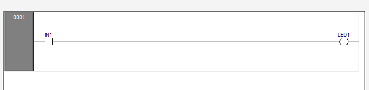
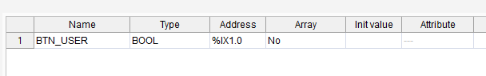
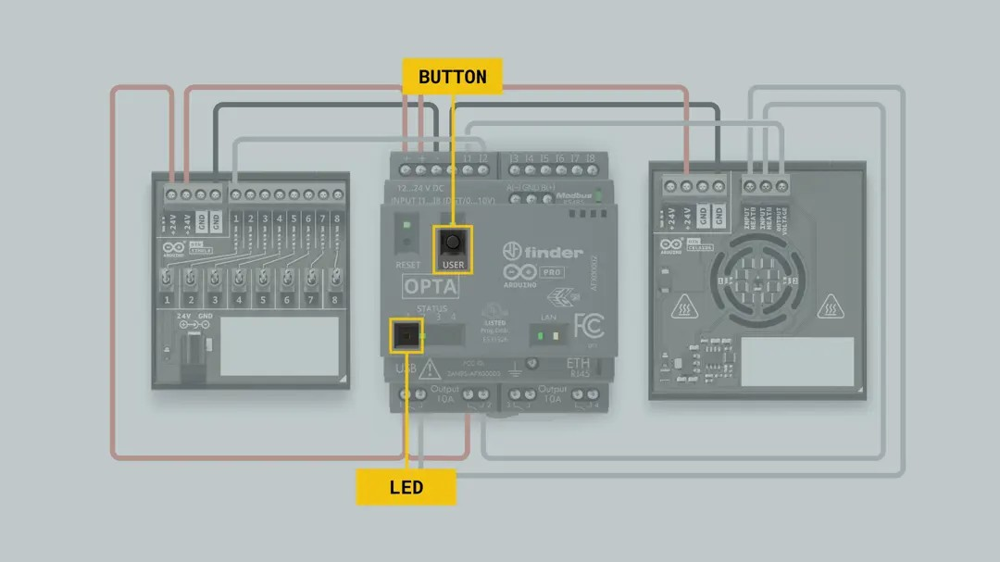

# Student Guide: Module 01 – First Steps with Arduino Opta

**Estimated Duration:** 1 hour  
**Format:** Hands-on with Arduino PLC IDE  
**Power Requirements:** USB-C only (no external power needed)

---

## Learning Objectives

By the end of this module, you will be able to:

- Connect and power the Arduino Opta using a USB-C cable  
- Install and use the Arduino PLC IDE to write and upload a program  
- Create a simple Ladder Logic program using the USER button to control the onboard LED  
- Run the program and observe input/output behavior on the Opta  

---

## Materials Required

- Arduino Opta WiFi (AFX00002)  
- USB-C to USB-A cable  
- Windows 10 or 11 laptop  
- Arduino PLC IDE version 1.0.3 or later  
  https://www.arduino.cc/en/software#arduino-plc-ide  

---

## Setup Steps

### 1. Power the Opta

- Connect your Opta to your computer using the USB-C cable  
- The board will be powered through USB-C for this module  
- No external 24V is required  

### 2. Install and Launch the Arduino PLC IDE

- Download the IDE from the official Arduino website  
- Install and open the application  
- Select your board: Arduino Opta (AFX00002)  

---

## First Program: Toggle LED with Button

### Overview

You’ll write a Ladder Logic program that turns on the Opta’s onboard LED when the USER button is pressed.

### Programming Steps

1. Create a new project in the Arduino PLC IDE  
2. Select the Arduino Opta WiFi as your board  
3. Add a new Ladder Diagram  
4. Insert a Normally Open contact and map it to `BTN_USER`  
5. Insert a Coil and map it to `LED_BUILTIN` or `PA5`  
6. Connect the contact and coil in a single rung

---

### Variable Mapping

- `BTN_USER` = Internal button input, mapped to pin `PC13`  
- `LED_BUILTIN` or `PA5` = Onboard LED, mapped to pin `PA5`

---

## Uploading and Running Your Program

- Open **Tools → Runtime → Flash Bootloader** (only needed once)  
- Activate the runtime  
- Switch the runtime mode to **RUN**  

### Test

- Press the USER button  
- The onboard LED should turn on while the button is held  

---

## Troubleshooting

| Problem                | Cause                      | Fix                                 |
|------------------------|----------------------------|--------------------------------------|
| LED does not light up  | Runtime is in STOP mode    | Switch to RUN mode in the IDE       |
| Button has no effect   | Mapping is incorrect       | Map `BTN_USER` to pin `PC13`        |

---

## Reflection Questions

- What role does `BTN_USER` play in your program?  
- Why is it important to correctly map inputs and outputs in PLCs?  
- What might happen in an industrial setting if input mappings are incorrect?

---

## Completion Checklist

- [ ] Opta connected via USB-C  
- [ ] Arduino PLC IDE installed and running  
- [ ] Ladder Logic program created  
- [ ] LED responds to USER button press  

---

## Key Terms

- **BTN_USER** – Internal button on the Opta (PC13)  
- **LED_BUILTIN** – Onboard LED (PA5)  
- **USB-C** – Supplies power and handles programming for logic only  

---

## Additional Resources

- Instructor Guide: `01_TG_First_Steps.md`  
- Arduino PLC Course – Getting Started:  
  https://courses.arduino.cc/explore-plc/lessons/getting-started/

Images and structure adapted from the official Arduino Explore PLC course under CC BY-SA 4.0 license. Attribution is required for reuse.
