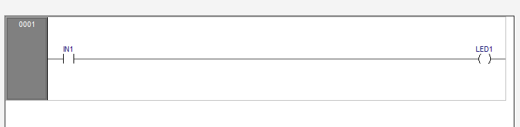
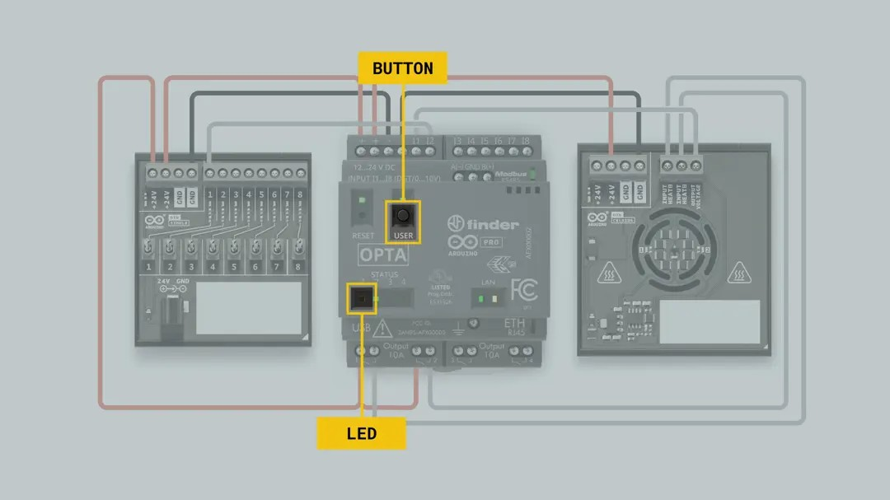

# Module 01 – First Steps with Arduino Opta

**Estimated Duration:** 1 hour  
**Format:** Hands-on + IDE walkthrough  
**Prerequisites:** None

---

## Module Purpose
This module introduces the core concept of digital input-to-output control using Ladder Logic in a PLC environment. It is designed to help students understand how a basic input (a button) can be mapped and used to control an output (an LED) entirely through internal logic, without requiring external wiring.

The focus is on:

- Understanding internal I/O mapping on the Arduino Opta (e.g., BTN_USER as a digital input mapped to PC13, and LED_BUILTIN mapped to PA5)

- Writing a single-rung Ladder Logic program

- Executing control logic using the Arduino PLC IDE

- Gaining familiarity with the PLC runtime environment (e.g., bootloader flashing, switching to RUN mode)

This foundational exercise simulates how industrial PLCs process binary (on/off) signals and execute programmed responses in real time, which is essential before advancing to more complex external wiring or analog logic in later modules.

Where this is taught:

- Code logic is introduced in the Student Guide and demo .st file

- Button/LED mapping is described in Arduino’s Getting Started Guide

- Additional clarification provided via input/output mapping diagrams and ladder screenshots in the GitHub 03_assets folder

---

## Learning Objectives

By the end of this module, students will be able to:

- Power and connect the Arduino Opta via USB-C for logic programming  
- Install and launch the Arduino PLC IDE  
- Upload a basic Ladder Logic program to control an onboard LED using the USER button  
- Understand basic variable mapping and runtime management  

---

## Materials Required

- Arduino Opta WiFi (AFX00002)  
- USB-C to USB-A cable (official or equivalent)  
- Windows 10 or 11 laptop  
- Arduino PLC IDE 1.0.3 or later  
  https://www.arduino.cc/en/software#arduino-plc-ide

---

## Setup Instructions

### 1. Connect and Power the Opta

- Connect the Opta to your computer via USB-C  
- No external 24VDC is required for this module  
- LED indicators will confirm board power  

### 2. Install and Launch the Arduino PLC IDE

- Download and install the IDE  
- Open the IDE and create a new project  
- Select board target: Arduino Opta (AFX00002)  

---

## First Program: Button-Controlled LED

### Step-by-Step

1. Create a new Ladder Diagram program

**Ladder Logic in IDE**

**Ladder Logic in text**

2. Insert a Normally Open (NO) contact and map it to `BTN_USER`  
3. Insert a Coil and map it to `LED_BUILTIN` or `PA5`  
4. Link the contact and coil in a single rung

**LED Mapping**
  

**Programmable Input Mapping**

---

### Variable Mapping

- `BTN_USER` → Internal digital input mapped to `PC13`  
- `LED_BUILTIN` or `PA5` → Onboard user LED

**Variable Mapping Table**

---

## Upload and Test

- Flash bootloader via **Tools → Runtime → Flash Bootloader** (if required)  
- Activate the runtime and switch to **RUN** mode  
- Press the USER button — the onboard LED should illuminate

---

## Troubleshooting

| Symptom              | Cause                          | Solution                          |
|----------------------|--------------------------------|-----------------------------------|
| LED doesn’t respond  | Runtime is not active          | Set PLC to RUN mode in IDE        |
| BTN_USER not recognized | Variable mapping not defined | Assign PC13 to BTN_USER under Resources |

---

## Completion Checklist

- [ ] Program uploaded successfully  
- [ ] LED turns on when USER button is pressed  
- [ ] Runtime stays active  

---

## Key Terms

- **BTN_USER** – Internal pushbutton on the Opta (PC13)  
- **LED_BUILTIN** – Internal LED on the Opta (PA5)  
- **Ladder Logic** – Graphical PLC programming language based on relay logic  
- **Runtime Mode** – Active execution mode for the PLC program  

---

## Tools Required

- Windows laptop with Arduino PLC IDE  
- USB-C to USB-A cable  
- No external power supply or wiring required  

---

## Resources

- Student Guide: `01_SG_First_Steps.md`  
- Variable Mapping: `../03_assets/01_first_steps/01_button_mapping.png`  
- Ladder Logic Example: `../03_assets/01_first_steps/01_ladder_logic.png`  
- Arduino Course – Getting Started:  
  https://courses.arduino.cc/explore-plc/lessons/getting-started/

This module includes material adapted from the official Arduino Explore PLC course under the Creative Commons CC BY-SA 4.0 license. Attribution is required for reuse.

---

This module introduces the foundational steps for working with the Arduino Opta using safe internal components. It prepares students for future modules involving external digital inputs and outputs.
