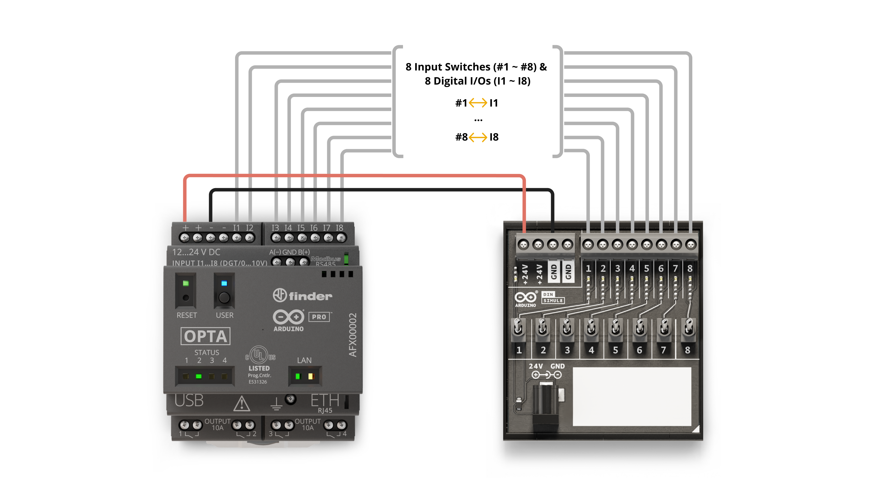
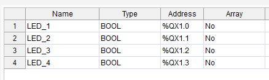

# Student Curriculum: Module 02 – Binary Input Counter Using DIN Simul8

**Estimated Duration:** 1.5 – 2 hours  
**Format:** Hands-on logic and programming (hardware pre-wired)  
**Power Requirements:** Provided by instructor  

---

## Module Purpose

This module introduces students to the concept of digital input reading and binary counting using Structured Text (ST). Students learn how to monitor the state of physical switches via the DIN Simul8 module and represent those states as a single binary number. This forms the basis for more complex control systems where multiple inputs determine system behavior. Instructors should focus on explaining how digital inputs are mapped, how binary numbers represent switch states, and how to use bitwise logic (AND) to manipulate outputs based on the input count.

Reference material: [Arduino Explore PLC – DIN Simul8 Digital Inputs](https://courses.arduino.cc/explore-plc/lessons/getting-started-din-simul8/)


---

## Learning Objectives

By the end of this module, students will be able to:

- Identify input behavior using the DIN Simul8 and Arduino Opta
- Write Structured Text (ST) to count active inputs
- Convert the count to binary and display it on the Opta’s onboard LEDs
- Apply bitwise operations to solve logic problems
- Observe and interpret PLC input/output states

---

## Materials Provided (Pre-Wired)

| Item                            | Provided By |
|---------------------------------|-------------|
| Arduino Opta WiFi (AFX00002)   | Instructor  |
| DIN Simul8 Module               | Instructor  |
| USB-C to USB-A cable            | Instructor  |
| 24V DC power supply             | Instructor  |
| Jumper wires (pre-connected)   | Instructor  |
| Arduino PLC IDE (v1.0.3 or later) | Student Laptop |

> **Note:** Do not alter any wiring. The system is pre-wired for safety and consistency.

**Wiring Diagram**


---

## Program Logic – Structured Text (ST)

This Structured Text program reads input states from the Simul8 switches, counts how many are ON, and displays that number in **binary** using Opta’s onboard LEDs.

```iecst
VAR
  switchCount : INT := 0;
END_VAR

switchCount := 0;

IF Input_1 THEN switchCount := switchCount + 1; END_IF;
IF Input_2 THEN switchCount := switchCount + 1; END_IF;
IF Input_3 THEN switchCount := switchCount + 1; END_IF;
IF Input_4 THEN switchCount := switchCount + 1; END_IF;
IF Input_5 THEN switchCount := switchCount + 1; END_IF;
IF Input_6 THEN switchCount := switchCount + 1; END_IF;
IF Input_7 THEN switchCount := switchCount + 1; END_IF;
IF Input_8 THEN switchCount := switchCount + 1; END_IF;

LED_4 := (switchCount AND 1) <> 0;
LED_3 := (switchCount AND 2) <> 0;
LED_2 := (switchCount AND 4) <> 0;
LED_1 := (switchCount AND 8) <> 0;
```


**Structured Text Code**


## LED Output Map




## Variable Mapping Diagram


---

## Upload and Test

1. Open Arduino PLC IDE
2. Create a new project and select **Arduino Opta WiFi**
3. Add a Structured Text program and paste the code
4. Flash the bootloader (first time only)
5. Activate runtime and switch to **RUN** mode

---

## Test Scenarios

| Switches Pressed      | Count | Binary | LEDs Lit          |
|------------------------|--------|--------|-------------------|
| X0                    | 1      | `0001` | LED_4             |
| X0, X2, X6            | 3      | `0011` | LED_3 + LED_4     |
| All 8                 | 8      | `1000` | LED_1             |

---

## Troubleshooting Guide

| Symptom               | Possible Cause             | Suggested Fix                     |
|------------------------|-----------------------------|------------------------------------|
| No LEDs lighting       | PLC not in RUN mode         | Set runtime mode to RUN            |
| LEDs not responding    | Input not updating          | Ask instructor to verify setup     |
| Upload fails           | Bootloader not flashed      | Flash bootloader via Tools menu    |

---

## Completion Checklist

- [ ] Logic uploaded and executed without errors
- [ ] LEDs reflect binary count of active switches
- [ ] Student can explain how the bitwise logic works
- [ ] Student can match physical switches to expected LED output


## Key Terms

- **DIN Simul8:** Pre-wired digital input simulator with 8 switches
- **Digital Input (DI):** 24V signal interpreted as logic TRUE (1)
- **Bitwise AND:** Operator that compares individual bits in integers
- **Structured Text (ST):** IEC 61131-3 language used in industrial PLCs

---

Images and structure adapted from the official Arduino Explore PLC course under CC BY-SA 4.0 license. Attribution is required for reuse.
