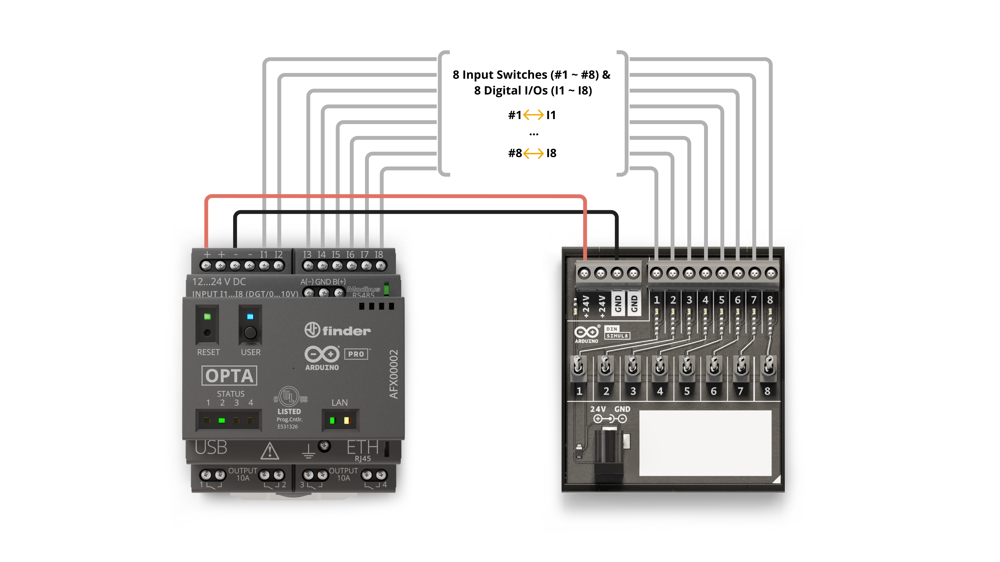
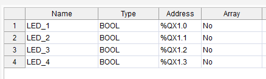
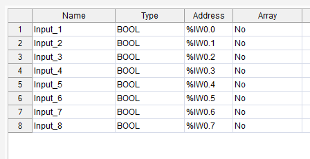

# Instructor Notes: Module 02 – Binary Input Counter (DIN Simul8)

---

## Module Purpose

This module introduces students to the concept of digital input reading and binary counting using Structured Text (ST). Students learn how to monitor the state of physical switches via the DIN Simul8 module and represent those states as a single binary number. This forms the basis for more complex control systems where multiple inputs determine system behavior. Instructors should focus on explaining how digital inputs are mapped, how binary numbers represent switch states, and how to use bitwise logic (AND) to manipulate outputs based on the input count. Instructors should emphasize how structured logic maps cleanly to visual input states and reinforce this with live input toggling and LED changes during the lab session.

Reference material: [Arduino Explore PLC – DIN Simul8 Digital Inputs](https://courses.arduino.cc/explore-plc/lessons/getting-started-din-simul8/)


---

## Pre-Lab Setup

This module uses **pre-wired hardware only**. Students do not connect any physical inputs or outputs.

### Required Hardware
- Arduino Opta WiFi (AFX00002)
- DIN Simul8 Module
- 24V DC Power Supply (barrel jack)
- USB-C to USB-A cable
- Jumper wires (20–22 AWG, pre-cut)
- Laptop with Arduino PLC IDE v1.0.3 or newer

---

## Wiring Instructions

### Wiring Length Reference
| From (DIN Simul8) | To (Opta Input) | Recommended Length | Notes                                            |
| ----------------- | --------------- | ------------------ | ------------------------------------------------ |
| X0                | I1              | 12 cm              | Route cleanly along edge of DIN rail             |
| X1                | I2              | 13 cm              | Crosses one signal wire; avoid overlap           |
| X2                | I3              | 14 cm              | Allow slight slack to accommodate bend radius    |
| X3                | I4              | 15 cm              | Can be bundled with X2 → I3                      |
| X4                | I5              | 16 cm              | Route under power leads if possible              |
| X5                | I6              | 17 cm              | Avoid routing near 24V barrel connector          |
| X6                | I7              | 18 cm              | Use shortest path across board to reduce clutter |
| X7                | I8              | 19 cm              | End of array; route behind others if needed      |
| GND               | Opta GND        | 10 cm              | Common GND; keep away from input bundle          |

### Additional Notes
- Use 20-22 AWG stranded wire.
- Color coding:
  - Red for +24V
  - Black for GND
  - White, Blue or Green for signal (X0 - X7)

### Power
- Connect 24V DC power to both:
  - Opta VIN terminals (+24V and GND)
  - DIN Simul8 +24V and GND terminals

### Signal
- Connect DIN Simul8 outputs to Opta inputs:
  - X0 → I1
  - X1 → I2
  - ...
  - X7 → I8

> Ensure **shared GND** between all devices.  
> Test continuity between each X# → I# pair before powering the system.


---

## Pre-Test Program

Use this logic to validate LED output before class:

```iecst
VAR
  switchCount : INT := 0;
END_VAR

switchCount := 0;

IF Input_1 THEN switchCount := switchCount + 1; END_IF;
... (repeat for Input_2 through Input_8)

LED_4 := (switchCount AND 1) <> 0;
LED_3 := (switchCount AND 2) <> 0;
LED_2 := (switchCount AND 4) <> 0;
LED_1 := (switchCount AND 8) <> 0;
```

**Structured Text Code**


---

## LED Output Map



---

## Variable Mapping Diagram



## Learning Outcomes to Assess

Students should:
- Correctly describe how switch states convert to binary
- Understand `switchCount` logic and the use of AND masks
- Successfully upload and run their code on the Opta
- Explain which LEDs should be active for a given input count

---

Suggested Reflection Questions

- Why is a counter variable used instead of just checking each switch directly?

- How does bitwise logic allow you to control multiple LEDs from one value?

- What real-world systems use similar logic for input counting?

- How could incorrect wiring or GND errors affect binary counting?


---

## Common Student Issues

| Symptom                   | Fix                                 |
|----------------------------|--------------------------------------|
| No LEDs at all            | Runtime not in RUN mode              |
| Upload fails              | Bootloader not flashed               |
| Wrong LEDs lighting       | Simul8 wired incorrectly             |
| Inputs appear stuck       | GND not properly shared              |

---

## Suggested Instructor Folder Structure

```
/Instructor/
├── Module_02_Instructor_Notes.md
├── Simul8_Wiring_Diagram.png
├── Pre-Test_Code.st
└── Module_02_Presentation.pptx
```

---

## Instructor Checklist

- [ ] System powered and confirmed operational
- [ ] All 8 Simul8 inputs tested
- [ ] LED binary output verified
- [ ] IDE configured and Opta connected
- [ ] Student environment ready (no exposed wiring)

---

## Resources

- Student Guide: [02_SG_Binary_Input_Counter](02_SG_Binary_Input_Counter.md)
- Arduino Course – Getting Started:  
  https://courses.arduino.cc/explore-plc/lessons/getting-started-din-simul8/


Images and structure adapted from the official Arduino Explore PLC course under CC BY-SA 4.0 license. Attribution is required for reuse.
