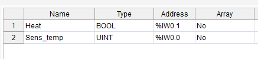
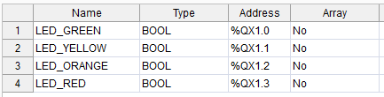
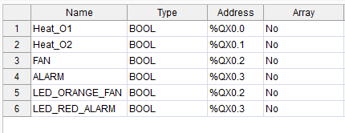
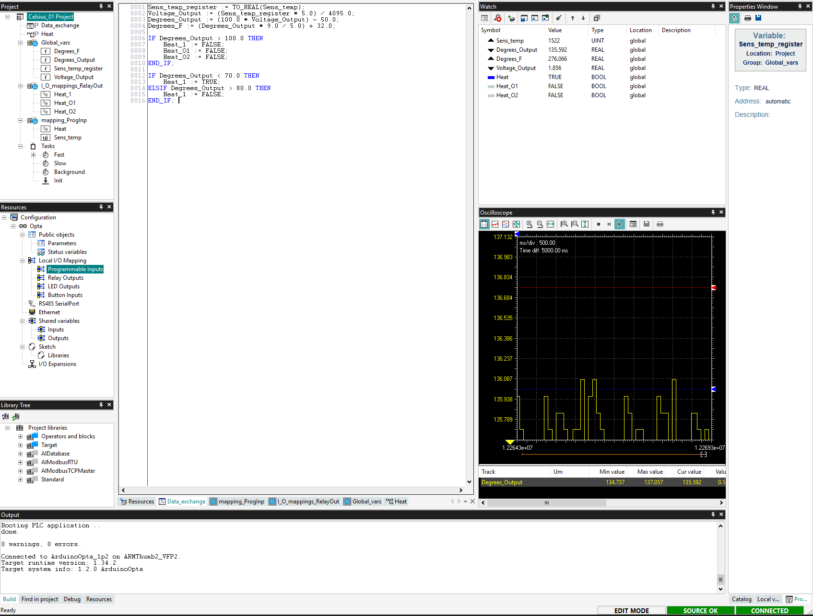

# Student Curriculum: Module 03 – Celsius Sensor & Heating Control

**Estimated Duration:** 1.5 – 2 hours  
**Format:** Hands-on sensor-based control logic (hardware pre-wired)  
**Power Requirements:** Provided by instructor  

---

## Module Purpose

This module introduces students to analog signal processing and real-world control logic using the TMP236 temperature sensor and relay outputs. The objective is to teach students how to:

- Read analog inputs from a sensor
- Convert voltage to Celsius and Fahrenheit
- Use smoothing (`Avg_Temp`) to stabilize sensor data
- Control relays with hysteresis logic
- Drive outputs (fan, heater, alarm) based on environmental conditions

Note: `Avg_Temp` is a smoothed version of the temperature that filters out noise and prevents rapid toggling. This helps the relays behave more like industrial systems, avoiding flicker.

This mirrors industrial use cases such as environmental chambers, HVAC systems, and process control systems. Instructors should emphasize sensor input scaling, control thresholds, and safety logic for overheat conditions.

📖 Reference material:  
[Arduino Explore PLC – Analog Input Basics](https://courses.arduino.cc/explore-plc/lessons/heating-resistors-with-2-switches/)


---

## What You'll Learn

- How to read analog signals with a PLC
- How temperature sensors work in real systems
- How to smooth temperature values to make better decisions
- How relays and indicators are controlled based on those decisions
 
 ---

## Learning Objectives

By the end of this module, students will be able to:

- Read analog values from a TMP236 temperature sensor
- Convert analog voltage to Celsius and Fahrenheit readings
- Apply hysteresis logic for controlling heating elements
- Control relays and indicators based on temperature thresholds
- Use Watch and Oscilloscope tools to observe real-time data

---

## Materials Provided (Pre-Wired)

| Item                            | Provided By |
|---------------------------------|-------------|
| Arduino Opta (via USB-C)        | Instructor  |
| TMP236 Analog Temperature Sensor| Instructor  |
| Heating relays (Relay 1 and 2)  | Instructor  |
| Optional: Fan relay, Alarm LED  | Instructor  |
| Multimeter (for verification)   | Optional    |
| Arduino PLC IDE (v1.0.3 or later)| Student Laptop |

> **Note:** Ensure TMP236 is properly powered. Do not alter wiring unless instructed.

---
## Wiring Diagram

[Wiring Diagram: TMP236 Sensor to Opta](../../03_assets/03_Celsius_Sensor_Control/Module03_Wiring_DINSimul8.png)

---

## Program Logic – Structured Text (ST)

```iecst
VAR
  Sens_temp : UINT;           // Raw analog input from AI0
  Temp_Register : REAL;
  Voltage_Output : REAL;
  Degrees_Output : REAL;
  Degrees_F : REAL;
  Avg_Temp : REAL := 0.0;

  Heat_O1 : BOOL := FALSE;
  Heat_O2 : BOOL := FALSE;
  LED_ORANGE_FAN : BOOL := FALSE;
  LED_RED_ALARM : BOOL := FALSE;
END_VAR

// Convert analog input to temperature
Temp_Register := TO_REAL(Sens_temp);
Voltage_Output := (Temp_Register * 5.0) / 4095.0;
Degrees_Output := (100.0 * Voltage_Output) - 50.0;
Degrees_F := (Degrees_Output * 9.0 / 5.0) + 32.0;

// Apply exponential smoothing
Avg_Temp := (Avg_Temp * 0.9) + (Degrees_Output * 0.1);

// Heater control logic
IF Avg_Temp < 72.0 THEN
   Heat_O1 := TRUE;
   Heat_O2 := TRUE;
ELSIF Avg_Temp > 78.0 THEN
   Heat_O1 := FALSE;
   Heat_O2 := FALSE;
END_IF;

// Fan indicator logic
IF Avg_Temp > 86.0 THEN
   LED_ORANGE_FAN := TRUE;
ELSE
   LED_ORANGE_FAN := FALSE;
END_IF;

// Overheat alarm logic
IF Avg_Temp > 95.0 THEN
   LED_RED_ALARM := TRUE;
ELSE
   LED_RED_ALARM := FALSE;
END_IF;
```

**Structured Text Code**  
[03_Celsius_Sensor_Control.st](../../02_code_samples/03_Celsius_Sensor_Control.st)


---

## Mapping








---

## Upload and Test

1. Open Arduino PLC IDE
2. Create a new project and select **Arduino Opta**
3. Add a Structured Text program and paste the code
4. Flash the bootloader (if needed)
5. Activate runtime and switch to **RUN** mode

---

## Test Scenarios

| Temperature (°C) | Avg_Temp | Heater 1 & 2 | Fan LED | Alarm LED |
|------------------|----------|--------------|---------|-----------|
| 68               | <72      | ON           | OFF     | OFF       |
| 74               | 72–78    | No change    | OFF     | OFF       |
| 80               | >78      | OFF          | OFF     | OFF       |
| 88               | >86      | OFF          | ON      | OFF       |
| 96               | >95      | OFF          | ON      | ON        |

---

## Real-Time Data Monitoring (Watch & Oscilloscope)



- `Avg_Temp` gradually tracks temperature input
- `Heat_O1` and `Heat_O2` toggle ON/OFF at 72–78°C
- `LED_ORANGE_FAN` and `LED_RED_ALARM` light up at correct thresholds

---

## Troubleshooting Guide

| Symptom                 | Possible Cause                  | Suggested Fix                          |
|--------------------------|----------------------------------|-----------------------------------------|
| No temperature reading   | Sensor not powered               | Check TMP236 wiring and supply          |
| Relays not switching     | COM terminal not powered         | Apply voltage to relay COM terminals    |
| Unexpected LED behavior  | Faulty threshold or sensor noise | Verify `Avg_Temp` and hysteresis logic  |

---

## Completion Checklist

- [ ] Program uploaded and executed without errors
- [ ] Relays respond correctly to Avg_Temp values
- [ ] LEDs indicate fan and alarm conditions accurately
- [ ] Student can explain logic and temperature smoothing

---

## Quick Self-Test

- What temperature turns on the heater relays?
- What is the purpose of hysteresis in this lab?
- How is `Degrees_F` calculated from `Degrees_Output`?

---

## Key Terms

- **Analog Input (AI):** Continuous voltage-based input (0–5V)
- **TMP236:** Precision analog temperature sensor
- **Hysteresis:** Control logic to prevent rapid toggling of outputs
- **Structured Text (ST):** IEC 61131-3 programming language for PLCs
- **Relay Output:** Electrically-controlled switch to activate devices

---

## Reference

- [Arduino PLC Course – Analog Input Example](https://courses.arduino.cc/explore-plc/lessons/heating-resistors-with-2-switches/)
  *(Used for baseline logic. Modified and extended for sensor control.)*

Images and structure adapted from the official Arduino Explore PLC course under CC BY-SA 4.0 license. Attribution is required for reuse.

