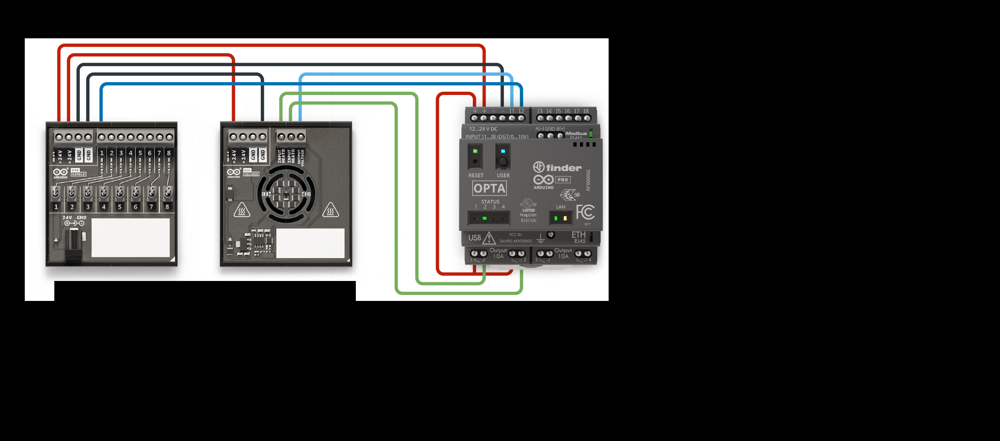
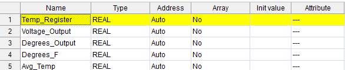
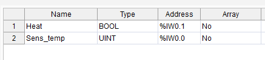
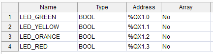
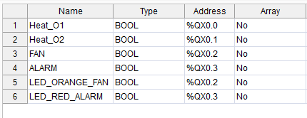
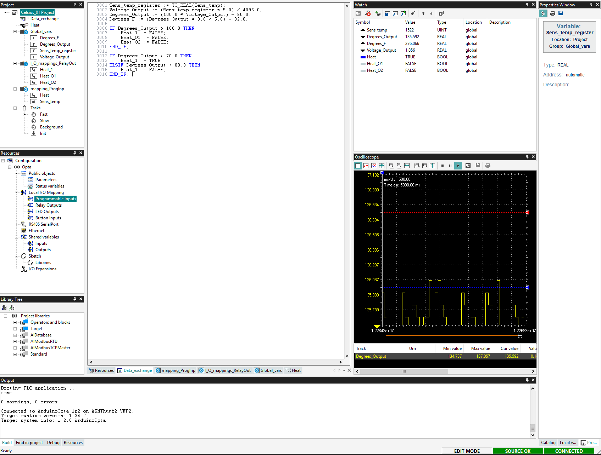

# Instructor Notes: Module 03 – Celsius Sensor & Heating Control

---

## Module Purpose

This module introduces students to analog signal processing and real-world control logic using the TMP236 temperature sensor and relay outputs. The objective is to teach students how to:

- Read analog inputs from a sensor
- Convert voltage to Celsius and Fahrenheit
- Use smoothing (`Avg_Temp`) to stabilize sensor data
- Control relays with hysteresis logic
- Drive outputs (fan, heater, alarm) based on environmental conditions

This mirrors industrial use cases such as environmental chambers, HVAC systems, and process control systems. Instructors should emphasize sensor input scaling, control thresholds, and safety logic for overheat conditions.

📖 Reference material:  
[Arduino Explore PLC – Analog Input Basics](https://courses.arduino.cc/explore-plc/lessons/heating-resistors-with-2-switches/)


---

## Pre-Lab Setup

This module uses **pre-wired sensor and relay outputs**. Students do not need to modify wiring.

### Required Hardware
- Arduino Opta
- TMP236 Analog Temperature Sensor
- Heating relays (Relay 1 and Relay 2)
- Optional: Fan relay and Alarm LED
- 24V DC Power Supply
- USB-C to USB-A cable
- Laptop with Arduino PLC IDE v1.0.3 or newer

---

## Wiring Instructions

### Power
- Connect 24V DC power to:
  - Opta VIN terminals (+24V and GND)
  - Relay module COM terminals

### Signal
- Connect sensor and output devices to Opta:
  - TMP236 VOUT → AI0 (I1)
  - Relay 1 (Heater 1) → O1
  - Relay 2 (Heater 2) → O2
  - Optional Fan → O3
  - Optional Alarm LED → O4

> Ensure the **TMP236 sensor is powered (Vcc and GND)**.  
> Each relay COM terminal must receive +V for output switching.



---

## Pre-Test Program

- To demonstrate smooth analog-to-digital control loop
- To verify analog scaling matches real-world values (e.g., test with a hand warmer, cup of ice water, or potentiometer)

Use this Structured Text logic to confirm sensor and relay output behavior:

```iecst
VAR
  Sens_temp : UINT;
  Temp_Register : REAL;
  Voltage_Output : REAL;
  Degrees_Output : REAL;
  Avg_Temp : REAL := 0.0;
  Heat_O1 : BOOL := FALSE;
  Heat_O2 : BOOL := FALSE;
END_VAR

Temp_Register := TO_REAL(Sens_temp);
Voltage_Output := (Temp_Register * 5.0) / 4095.0;
Degrees_Output := (100.0 * Voltage_Output) - 50.0;
Avg_Temp := (Avg_Temp * 0.9) + (Degrees_Output * 0.1);

IF Avg_Temp < 72.0 THEN
   Heat_O1 := TRUE;
   Heat_O2 := TRUE;
ELSIF Avg_Temp > 78.0 THEN
   Heat_O1 := FALSE;
   Heat_O2 := FALSE;
END_IF;
```

> Use a potentiometer or known temperature source for testing.
> This verifies the sensor scaling and relay logic thresholds before full deployment. It introduces students to the analog-to-digital conversion process and allows instructors to explain signal smoothing (`Avg_Temp`) and output control with hysteresis.


**Structured Text Code**
[03_Celsius_Sensor_Control.st](../../02_code_samples/03_Celsius_Sensor_Control.st)

---

## Mapping

**Global Variables Mapping**


**Input Signal Mapping** 


**LED Output Assignment**


**Relay Output Mapping**


---

## IDE and Runtime Setup Tips

- Verify target board is set to Arduino Opta WiFi
- Flash bootloader before uploading code (Tools > Runtime > Flash Bootloader)
- Switch PLC to RUN mode after upload
- Use Watch and Oscilloscope tools to monitor `Avg_Temp`, `Heat_O1`, and `LED_RED_ALARM`

---

## Instructor Delivery Flow

1. Confirm wiring and 24V supply to all devices
2. Upload pre-test logic and verify relay function
3. Walk through control logic and `Avg_Temp` smoothing
4. Use **Watch Tool** to observe `Avg_Temp`, `Heat_O1`, `Heat_O2`
5. Use **Oscilloscope Tool** to monitor analog transitions in real time
6. Discuss runtime behavior across temperature thresholds
7. Assess with runtime observation and checklist
8. Conclude with discussion based on reflection questions


---

##  Learning Outcomes Alignment

| Learning Outcome                                                  | Demonstrated Through                               | Measurable Indicator                          |
|------------------------------------------------------------------|----------------------------------------------------|-----------------------------------------------|
| Read and interpret analog input signals                          | Sensor input (TMP236) → `Voltage_Output`           | Oscilloscope trace, value displayed in Watch  |
| Convert voltage to Celsius and Fahrenheit                        | Structured Text math logic                         | Correct value for `Degrees_Output`, `Degrees_F`|
| Apply control logic with hysteresis                              | Heating ON/OFF thresholds                          | Heater relays activate at proper temp bounds   |
| Monitor and debug control logic in real time                     | Use of Watch & Oscilloscope tools                  | Student correctly explains `Avg_Temp` behavior |
| Use Boolean outputs to drive relays and indicators               | Fan and Alarm LED activation                       | Outputs toggle appropriately with temperature  |
| Write and deploy ST code in a PLC environment                    | IDE use, code upload, and runtime execution        | Program runs without errors; output observed   |

---

## Runtime Behavior Reference

| Condition       | Temp (°C) | Expected Output                 |
| --------------- | --------- | ------------------------------- |
| Cold start      | <72       | Heaters ON                      |
| Mid-range       | 72–78     | Heaters maintain previous state |
| Warm room       | >78       | Heaters OFF                     |
| Overheat risk   | >86       | Fan ON                          |
| Alarm condition | >95       | Fan ON + Alarm ON               |
| Near threshold  | 78–79     | Heaters remain OFF due to smoothing delay |


---

## Assessment Strategy

| Method                          | Description                                                                 |
|----------------------------------|-----------------------------------------------------------------------------|
| Observation                     | Instructor monitors student setup, runtime behavior, and I/O response       |
| Checklist Completion            | Students use module checklist for self-verification                        |
| Instructor Q&A                  | Student answers conceptual and technical questions post-lab                |
| Output Verification             | Relays, fan, and alarm states tested for at least 3 temperature thresholds |
| Reflection Questions            | Students complete 3 post-lab written reflections                           |

---

## Watch Testing

The Watch tool allows real-time inspection of variables such as Avg_Temp, Heat_O1, and Heat_O2, making it easier to demonstrate how temperature affects control logic.



Instructors should reinforce the connection between analog voltage conversion and digital control decisions — a key skill for industrial automation.

---

## Suggested Reflection Questions

1. Why is `Avg_Temp` used instead of raw `Degrees_Output`?
2. What industrial applications could use similar logic?
3. How would this system behave if the sensor was disconnected?

---

## Learning Outcomes to Assess

Students should:
- Explain how sensor voltage is converted to temperature
- Understand why `Avg_Temp` is used for smoothing
- Correctly implement temperature-based control logic
- Observe and interpret behavior of relays and LEDs based on thresholds

---

## Common Student Issues

| Symptom                   | Fix                                           |
|----------------------------|-----------------------------------------------|
| No temperature reading     | TMP236 not powered or miswired                |
| Relays do not activate     | COM terminals missing +24V                    |
| Output flickering          | Threshold too narrow – add hysteresis         |
| Alarm or fan doesn't trigger | Avg_Temp not reaching threshold – simulate input |

---

## Instructor Delivery Flow

1. Confirm wiring and 24V supply to all devices
2. Upload pre-test logic and verify relay function
3. Walk through control logic and `Avg_Temp` smoothing
4. Monitor behavior using Watch and Oscilloscope
5. Assess with runtime observation and checklist
6. Conclude with discussion based on reflection questions

---

## Suggested Instructor Folder Structure

```
/Instructor/
├── Module_03_Instructor_Notes.md
├── Sensor_Wiring_Diagram.png
├── Pre-Test_Heating_Code.st
```

---

## Instructor Checklist

- [ ] Sensor powered and returning valid values
- [ ] Relays wired and respond to code correctly
- [ ] IDE configured and project set up
- [ ] Opta in RUN mode and PLC is communicating
- [ ] Optional fan/alarm logic tested or simulated


## Reference

- [Student Guide Module 03](../../01_modules/03_Celsius_Sensor_Control/03_SG_Celsius_Sensor_Control.md)
- [Arduino PLC Course – Analog Input Example](https://courses.arduino.cc/explore-plc/lessons/heating-resistors-with-2-switches/)
  *(Used for baseline logic. Modified and extended for sensor control.)*

Images and structure adapted from the official Arduino Explore PLC course under CC BY-SA 4.0 license. Attribution is required for reuse.
